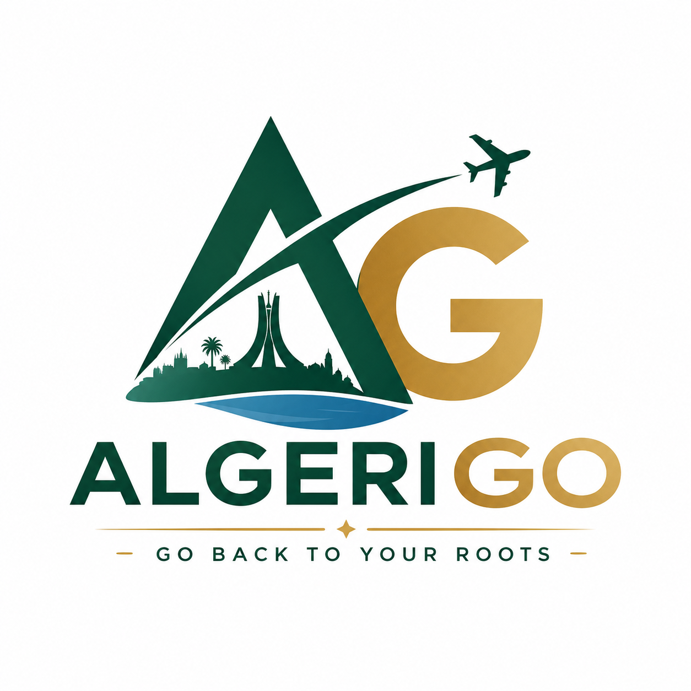
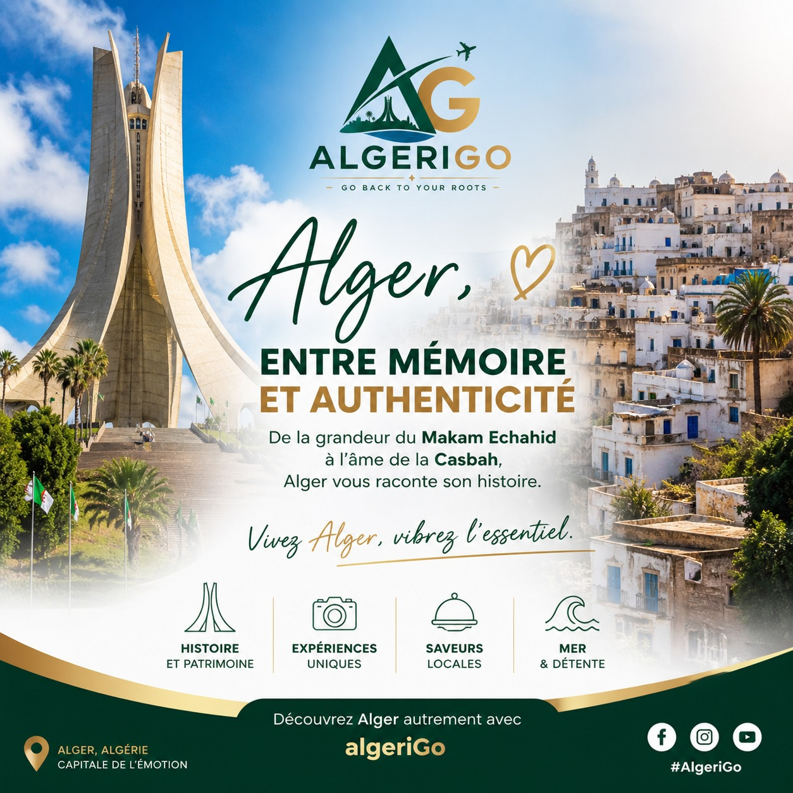
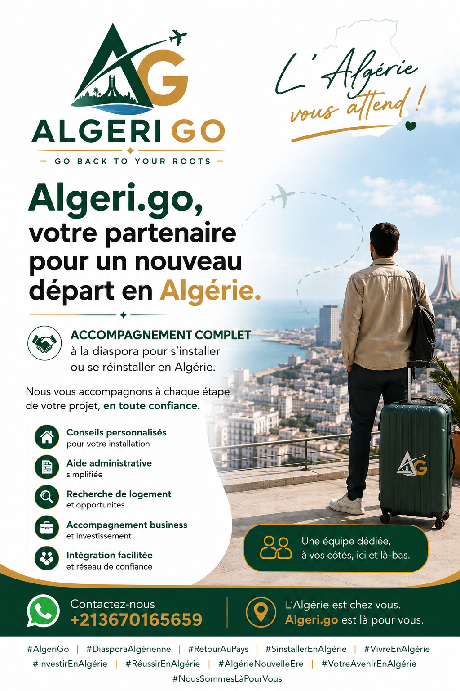
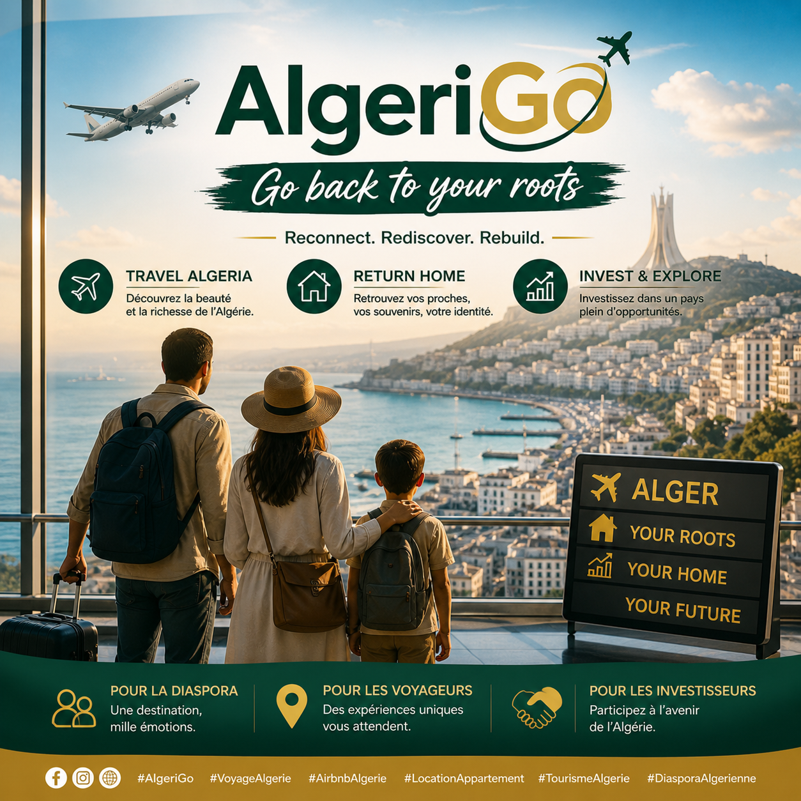

# Algerigo
<!doctype html>
<html lang="fr">
<head>
  <meta charset="utf-8" />
  <meta name="viewport" content="width=device-width, initial-scale=1" />
  <title>AlgeriGo | Go back to your roots</title>
  <meta name="description" content="AlgeriGo accompagne la diaspora, les voyageurs et les investisseurs pour découvrir, revenir et investir en Algérie." />
  <link rel="preconnect" href="https://fonts.googleapis.com" />
  <link rel="preconnect" href="https://fonts.gstatic.com" crossorigin />
  <link href="https://fonts.googleapis.com/css2?family=Inter:wght@400;500;600;700;800&display=swap" rel="stylesheet" />
  <link rel="stylesheet" href="styles.css" />
</head>
<body>
  <header class="site-header" aria-label="Navigation principale">
    <a class="brand" href="#accueil" aria-label="AlgeriGo accueil">
      
      AlgeriGo
    </a>
    <nav class="nav-links" aria-label="Sections du site">
      <a href="#services">Services</a>
      <a href="#circuits">Circuits</a>
      <a href="#parcours">Parcours</a>
      <a href="#investir">Investir</a>
      <a href="#contact">Contact</a>
    </nav>
    <a class="header-cta" href="#contact">Être accompagné</a>
  </header>

  <main id="accueil">
    <section class="hero" aria-labelledby="hero-title">
      

        
Diaspora, voyageurs, investisseurs

        <h1 id="hero-title">Expériences authentiques en Algérie.</h1>
        
AlgeriGo propose des expériences immersives pour découvrir l’Algérie au-delà du tourisme classique : histoire, culture vivante, rencontres locales et immersion réelle.

        

          <a class="button primary" href="#circuits">Voir les circuits</a>
          <a class="button secondary" href="#contact">Préparer mon projet</a>
        

      

      

        

          
        

        

          Go back to your roots
          <strong>Découvrir, revenir et investir avec un accompagnement local</strong>
        

      

    </section>

    <section class="trust-band" aria-label="Promesse AlgeriGo">
      
<strong>Information claire</strong>Guides pratiques et recommandations ciblées

      
<strong>Réseau fiable</strong>Prestataires, experts et partenaires vérifiés

      
<strong>Accompagnement humain</strong>Un parcours adapté à votre situation

    </section>

    <section class="section" id="services">
      

        
Trois portes d’entrée

        <h2>Choisissez le parcours qui correspond à votre projet.</h2>
      

      

        <article class="service-card discover">
          
          
✈

          <h3>Découvrir l’Algérie autrement</h3>
          
Voyages immersifs, circuits culturels, expériences sahariennes, tourisme patrimonial et immersion chez l’habitant.

          <a href="#contact">Planifier un séjour</a>
        </article>
        <article class="service-card return">
          
          
⌂

          <h3>Revenir au pays</h3>
          
Conseil administratif, installation, logement, orientation professionnelle, accompagnement familial et mise en relation locale.

          <a href="#contact">Préparer un retour</a>
        </article>
        <article class="service-card invest">
          
          
◆

          <h3>Explorer des opportunités</h3>
          
Orientation vers l’immobilier, l’agriculture, le tourisme, les petits projets entrepreneuriaux et les études de faisabilité simplifiées.

          <a href="#contact">Explorer les opportunités</a>
        </article>
      

    </section>

    <section class="section circuits-section" id="circuits">
      

        
Circuits - Alger, capitale et histoire

        <h2>Découvrir Alger avec prise en charge incluse.</h2>
        
Tous les circuits incluent l’accueil à l’aéroport, le transfert privé avec chauffeur et l’assistance à l’arrivée.

        
Équivalents en euros indiqués à titre estimatif, sur la base d’environ 1 EUR = 154 DZD.

      

      

        <article class="circuit-card">
          
1 jour · Historique

          <h3>Alger la Blanche & Casbah</h3>
          
Expérience immersive historique autour de la Casbah d’Alger, du Palais des Raïs, de la Mosquée Ketchaoua, de la Rue de la Marine et du front de mer.

          <ul>
            <li>Casbah d’Alger, site UNESCO</li>
            <li>Déjeuner traditionnel algérois</li>
            <li>Hôtels 2★, 3★ ou 4★ vue mer recommandés</li>
          </ul>
          <strong class="price">À partir de 6 500 DA (env. 42 €) / personne</strong>
        </article>
        <article class="circuit-card">
          
1 jour · Méditerranéen

          <h3>Alger entre mer et modernité</h3>
          
Découverte urbaine entre La Corniche, le Jardin d’Essai du Hamma, le Mémorial du Martyr, le centre-ville colonial et une pause café en bord de mer.

          <ul>
            <li>Front de mer et baie d’Alger</li>
            <li>Place de l’Émir Abdelkader</li>
            <li>Hôtels urbains, 3★ ou 4★ recommandés</li>
          </ul>
          <strong class="price">À partir de 5 500 DA (env. 36 €) / personne</strong>
        </article>
        <article class="circuit-card">
          
2 jours · Patrimoine vivant

          <h3>Alger spirituelle & traditions</h3>
          
Culture, spiritualité et traditions avec Casbah approfondie, mosquées historiques, ateliers artisanaux et quartiers historiques.

          <ul>
            <li>Visite guidée approfondie</li>
            <li>Artisanat : cuivre et zellige</li>
            <li>Maisons d’hôtes, hôtels 3★ ou boutique 4★</li>
          </ul>
          <strong class="price">À partir de 12 000 DA (env. 78 €) / personne</strong>
        </article>
        <article class="circuit-card">
          
Expérience locale

          <h3>Alger authentique</h3>
          
Immersion hors circuits touristiques avec marchés populaires, quartiers traditionnels, cuisine locale chez l’habitant et rencontre avec des artisans.

          <ul>
            <li>Bab El Oued et quartiers populaires</li>
            <li>Rencontres et cuisine locale</li>
            <li>Auberges, hôtels 3★ ou hébergements boutique</li>
          </ul>
          <strong class="price">À partir de 7 000 DA (env. 45 €) / personne</strong>
        </article>
      

    </section>

    <section class="split-section" id="parcours">
      

        
Pour qui ?

        <h2>Une plateforme pensée pour ceux qui ont un lien, une curiosité ou un projet avec l’Algérie.</h2>
      

      

        
<strong>Diaspora algérienne</strong>France, Belgique, Canada, Royaume-Uni, Allemagne, pays du Golfe.

        
<strong>Voyageurs étrangers</strong>Touristes, créateurs de contenu, journalistes et chercheurs.

        
<strong>Investisseurs</strong>Entrepreneurs, PME étrangères, fonds d’investissement et porteurs de projets.

      

    </section>

    <section class="innovation" id="investir">
      

        
Positionnement AlgeriGo

        <h2>Une passerelle entre l’Algérie et le monde.</h2>
        
AlgeriGo n’est pas seulement une agence de voyage. C’est une plateforme entre tourisme expérientiel, accompagnement de la diaspora et opportunités économiques.

      

      

        Tourisme expérientiel
        Retour au pays
        Opportunités économiques
        Parcours personnalisés
        Cartographie interactive
        Réseau d’experts
      

    </section>

    <section class="section contact-section" id="contact">
      

        

          
Commencer

          <h2>Parlez-nous de votre projet en Algérie.</h2>
          
Que vous prépariez un voyage, un retour ou un investissement, AlgeriGo vous aide à clarifier les étapes et à identifier les bons contacts.

        

        <form class="contact-form" action="https://formspree.io/f/mzdqvyva" method="POST" aria-label="Formulaire de contact AlgeriGo">
          <input type="hidden" name="_subject" value="Nouvelle demande depuis le site AlgeriGo" />
          <label>
            Nom complet
            <input type="text" name="name" placeholder="Votre nom" autocomplete="name" required />
          </label>
          <label>
            Type de projet
            <select name="project" required>
              <option value="">Choisir un parcours</option>
              <option>Découvrir l’Algérie</option>
              <option>Revenir au pays</option>
              <option>Investir en Algérie</option>
            </select>
          </label>
          <label>
            Email
            <input type="email" name="email" placeholder="vous@email.com" autocomplete="email" required />
          </label>
          <label>
            Message
            <textarea name="message" rows="4" placeholder="Expliquez votre besoin en quelques lignes"></textarea>
          </label>
          <button type="submit">Envoyer ma demande</button>
          

        </form>
      

    </section>
  </main>

  <footer>
    
    AlgeriGo - Go back to your roots
  </footer>

  
</body>
</html>
